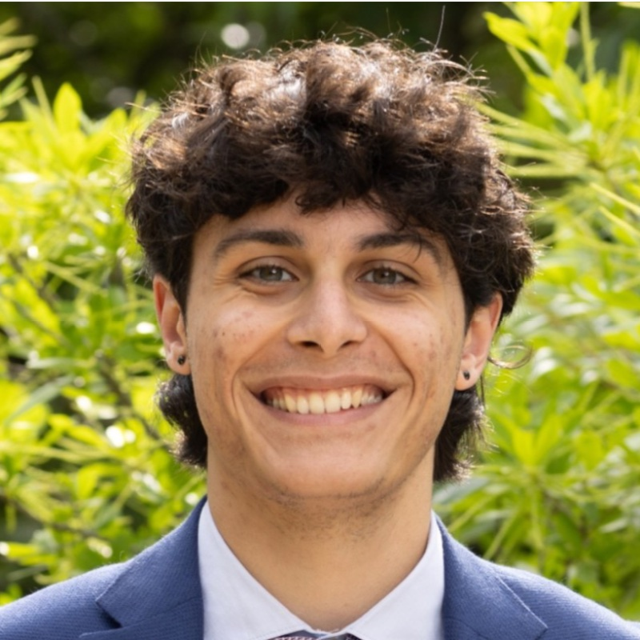

::: {.hero}
{.hero-photo fig-alt="Yusuf Ozaydin"}

::: {.hero-text}
# Yusuf Ozaydin

::: {.headline}
Systems engineering student at GW · operations research and human-centered design [(he/him)]{.pronouns}
:::

::: {.hero-links}
[yusuf.ozaydin@gwmail.gwu.edu](mailto:yusuf.ozaydin@gwmail.gwu.edu)
[LinkedIn](https://www.linkedin.com/in/yusuf-ozaydin)
[GitHub](https://github.com/yusuf-ozaydin)
:::
:::
:::

I'm a systems engineering student at George Washington University, with minors in
mathematics and computer science. I work on operations research and human-centered
design, and I like problems where the math and the person using the result both matter.

I'm looking for a summer 2027 internship in operations research or data analysis.

::: {.btn-row}
[Projects](projects.qmd){.btn .btn-primary}
[CV](cv.qmd){.btn .btn-outline-primary}
:::

## About

In summer 2025 I worked with a research group at UAB on emergency-department
overcrowding. The project builds prediction models and discrete-event simulation to help
hospitals manage patient flow. My job was the data side: taking messy hospital records
and getting them clean and consistent enough to build features from, then helping
prepare and debug the Python pipeline and tune the models.

At GW I built [Paceometer](projects/paceometer.qmd), a driving app. A professor brought
me the idea and stays on as advisor; the build and the research are mine. It shows how
many seconds you are behind an efficient pace instead of showing raw speed, since a
plain speedometer quietly rewards going faster and drivers already overestimate the time
they save by speeding. I found a trip metric that inverted at highway speeds and
replaced it, wrote the supporting
[literature review](https://raw.githack.com/yusuf-ozaydin/paceometer/refs/heads/main/paceometer_review.html),
and ran the interface through a WCAG accessibility audit. It is in pilot testing now.

Smaller things fill the rest of my time.
[Music Graph](projects/music-graph.qmd) turns my Spotify library into a network of songs
connected by shared artists and playlists. [Lift Log](projects/lift-log.qmd) is a
workout tracker I built because I wanted one that fit the way I actually train.

Away from a screen I coach middle-school soccer and still play. I play guitar, and I can
get by on clarinet, drums, and vocals. I also keep a few small side projects going,
usually games-related, though a surprising number of them end up being about music.
